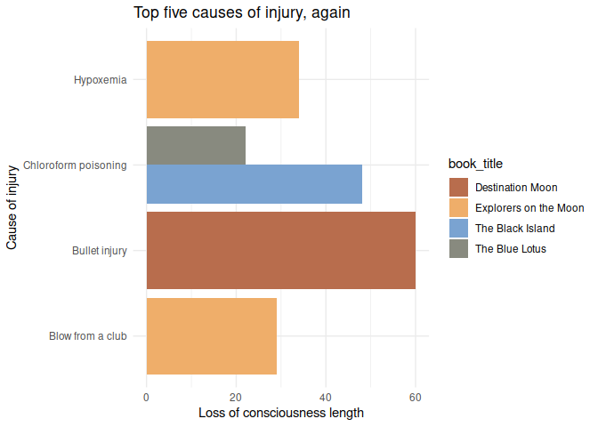

<!-- README.md is generated from README.Rmd. Please edit that file -->

# tintin

<!-- badges: start -->

<!-- badges: end -->

The goal of tintin is to provide palettes generated from Tintin covers.
There is one palette per cover, with a total of 24 palettes of 5 colours
each. Includes functions to interpolate colors in order to create more
colors based on the provided palettes.


## Installation

You can install the development version of tintin like so:

``` r
remotes::install_github("pachadotdev/tintin")
```

## Example

This is a basic example which shows you how to create a plot. We’ll plot
the top five causes of injury in the `tintin_head_trauma` dataset that
comes with the package.

``` r
library(dplyr)
library(ggplot2)
library(tintin)

total_head_trauma_5 <- tintin_head_trauma %>% 
  arrange(-loss_of_consciousness_length) %>% 
  filter(row_number() <= 5)

ggplot(total_head_trauma_5) +
  geom_col(aes(x = cause_of_injury, y = loss_of_consciousness_length, 
    fill = book_title), position = "dodge") +
  labs(x = "Cause of injury", y = "Loss of consciousness length",
    title = "Top five causes of injury") +
  theme_minimal() +
  scale_fill_manual(values = tintin_colours$the_black_island,
    name = "Book") +
  coord_flip()
```


What is special about the package is being able to pass the colours as a
function to `ggplot2`. We’ll adapt the previous example to show that
case.

``` r
ggplot(total_head_trauma_5) +
  geom_col(aes(x = cause_of_injury, y = loss_of_consciousness_length, 
    fill = book_title), position = "dodge") +
  labs(x = "Cause of injury", y = "Loss of consciousness length",
    title = "Top five causes of injury") +
  theme_minimal() +
  scale_fill_tintin_d(option = "cigars_of_the_pharaoh", direction = -1) +
  coord_flip()
```


``` r

# Note that I can also write the palette name as
# "cigars of the pharaoh" or even as "CiGaRS  of ThE Pharaoh"
ggplot(total_head_trauma_5) +
  geom_col(aes(x = cause_of_injury, y = loss_of_consciousness_length, 
    fill = book_title), position = "dodge") +
  labs(x = "Cause of injury", y = "Loss of consciousness length",
    title = "Top five causes of injury, again") +
  theme_minimal() +
  scale_fill_tintin_d(option = "cigars of the pharaoh", direction = -1) +
  coord_flip()
```



What happens if we need more colours than 5? The functions in the
package can fix that. We’ll plot the top ten causes of injury.

``` r
total_head_trauma_10 <- tintin_head_trauma %>% 
  arrange(-loss_of_consciousness_length) %>% 
  filter(row_number() <= 10)

ggplot(total_head_trauma_10) +
  geom_col(aes(x = cause_of_injury, y = loss_of_consciousness_length, 
    fill = book_title), position = "dodge") +
  labs(x = "Cause of injury", y = "Loss of consciousness length",
    title = "Top ten causes of injury") +
  scale_fill_manual(values = tintin_clrs(
    n = length(unique(total_head_trauma_10$book_title)), 
    option = "the black island"),
    name = "Book") +
  coord_flip()
```


``` r

# or alternatively

ggplot(total_head_trauma_10) +
  geom_col(aes(x = cause_of_injury, y = loss_of_consciousness_length, 
    fill = book_title), position = "dodge") +
  labs(x = "Cause of injury", y = "Loss of consciousness length",
    title = "Top ten causes of injury") +
  scale_fill_manual(values = tintin_pal(option = "the black island")(8), 
    name = "Book") +
  coord_flip()
```


The use of colour instead of fill is analogous. Let’s plot the top ten
causes of injury per year to see it.

``` r
library(tidyr)

total_head_trauma_y <- tintin_head_trauma %>% 
  group_by(year) %>% 
  summarise_if(is.integer, sum) %>% 
  pivot_longer(loss_of_consciousness_length:loss_of_consciousness_severity)

ggplot(total_head_trauma_y) +
  geom_line(aes(x = year, y = value, color = name), linewidth = 1.5) +
  labs(x = "Year", y = "Loss of consciousness length/severity",
    title = "Result of injuries per year") +
  theme_minimal() +
  scale_colour_manual(values = tintin_pal(option = "the secret of the unicorn")(2), 
    name = "Cause of injury")
```


We can also use the package for the continuous case. For this case,
we’ll plot a map of Canada.

``` r
# updated 2023-03-26 from
# https://health-infobase.canada.ca/src/data/covidLive/vaccination-coverage-map.csv

library(canadamaps)

vaccination <- data.frame(
  pruid = c(10,11,12,13,24,35,46,47,48,59,60,61,62),
  proptotal_atleast1dose = c(96.1,89.9,89.7,86.9,80.8,84,82.2,81.7,79.7,86.7,84.8,79.1,85)
)

vaccination <- vaccination %>% 
  left_join(get_provinces(), by = "pruid") %>% # canadamaps in action
  mutate(
    label = paste(gsub(" /.*", "", prname),
                  paste0(proptotal_atleast1dose, "%"), sep = "\n"),
  )

vaccination %>% 
  ggplot() +
  geom_sf(aes(fill = proptotal_atleast1dose, geometry = geometry)) +
  geom_sf_label(aes(label = label, geometry = geometry)) +
  scale_fill_tintin_c(option = "the crab with the golden claws") +
  labs(title = "Cumulative percent of the population who have received at least 1 dose of a COVID-19 vaccine")
```


``` r
devtools::session_info()
#> ─ Session info ───────────────────────────────────────────────────────────────
#>  setting  value
#>  version  R version 4.3.1 (2023-06-16)
#>  os       Linux Mint 21.2
#>  system   x86_64, linux-gnu
#>  ui       X11
#>  language en_CA:en
#>  collate  en_CA.UTF-8
#>  ctype    en_CA.UTF-8
#>  tz       America/Toronto
#>  date     2023-07-31
#>  pandoc   2.9.2.1 @ /usr/bin/ (via rmarkdown)
#> 
#> ─ Packages ───────────────────────────────────────────────────────────────────
#>  package      * version    date (UTC) lib source
#>  cachem         1.0.8      2023-05-01 [1] CRAN (R 4.3.1)
#>  callr          3.7.3      2022-11-02 [1] CRAN (R 4.3.1)
#>  canadamaps   * 0.2        2023-07-31 [1] Github (pachadotdev/canadamaps@5973670)
#>  class          7.3-22     2023-05-03 [4] CRAN (R 4.3.1)
#>  classInt       0.4-9      2023-02-28 [1] CRAN (R 4.3.1)
#>  cli            3.6.1      2023-03-23 [1] CRAN (R 4.3.1)
#>  colorspace     2.1-0      2023-01-23 [1] CRAN (R 4.3.1)
#>  crayon         1.5.2      2022-09-29 [1] CRAN (R 4.3.1)
#>  crul           1.4.0      2023-05-17 [1] CRAN (R 4.3.1)
#>  curl           5.0.1      2023-06-07 [1] CRAN (R 4.3.1)
#>  DBI            1.1.3      2022-06-18 [1] CRAN (R 4.3.1)
#>  devtools     * 2.4.5      2022-10-11 [1] CRAN (R 4.3.1)
#>  digest         0.6.33     2023-07-07 [1] CRAN (R 4.3.1)
#>  dplyr        * 1.1.2      2023-04-20 [1] CRAN (R 4.3.1)
#>  e1071          1.7-13     2023-02-01 [1] CRAN (R 4.3.1)
#>  ellipsis       0.3.2      2021-04-29 [1] CRAN (R 4.3.1)
#>  evaluate       0.21       2023-05-05 [1] CRAN (R 4.3.1)
#>  fansi          1.0.4      2023-01-22 [1] CRAN (R 4.3.1)
#>  farver         2.1.1      2022-07-06 [1] CRAN (R 4.3.1)
#>  fastmap        1.1.1      2023-02-24 [1] CRAN (R 4.3.1)
#>  fs             1.6.2      2023-04-25 [1] CRAN (R 4.3.1)
#>  generics       0.1.3      2022-07-05 [1] CRAN (R 4.3.1)
#>  geojson        0.3.4      2020-06-23 [1] CRAN (R 4.3.1)
#>  geojsonio      0.11.1     2023-05-16 [1] CRAN (R 4.3.1)
#>  geojsonlint    0.4.0      2020-02-13 [1] CRAN (R 4.3.1)
#>  geojsonsf      2.0.3      2022-05-30 [1] CRAN (R 4.3.1)
#>  ggplot2      * 3.4.2      2023-04-03 [1] CRAN (R 4.3.1)
#>  glue           1.6.2      2022-02-24 [1] CRAN (R 4.3.1)
#>  gtable         0.3.3      2023-03-21 [1] CRAN (R 4.3.1)
#>  highr          0.10       2022-12-22 [1] CRAN (R 4.3.1)
#>  htmltools      0.5.5      2023-03-23 [1] CRAN (R 4.3.1)
#>  htmlwidgets    1.6.2      2023-03-17 [1] CRAN (R 4.3.1)
#>  httpcode       0.3.0      2020-04-10 [1] CRAN (R 4.3.1)
#>  httpuv         1.6.11     2023-05-11 [1] CRAN (R 4.3.1)
#>  jqr            1.2.3      2022-03-10 [1] CRAN (R 4.3.1)
#>  jsonlite       1.8.7      2023-06-29 [1] CRAN (R 4.3.1)
#>  jsonvalidate   1.3.2      2021-11-03 [1] CRAN (R 4.3.1)
#>  KernSmooth     2.23-22    2023-07-10 [4] CRAN (R 4.3.1)
#>  knitr          1.43       2023-05-25 [1] CRAN (R 4.3.1)
#>  labeling       0.4.2      2020-10-20 [1] CRAN (R 4.3.1)
#>  later          1.3.1      2023-05-02 [1] CRAN (R 4.3.1)
#>  lattice        0.21-8     2023-04-05 [4] CRAN (R 4.3.0)
#>  lazyeval       0.2.2      2019-03-15 [1] CRAN (R 4.3.1)
#>  lifecycle      1.0.3      2022-10-07 [1] CRAN (R 4.3.1)
#>  magrittr       2.0.3      2022-03-30 [1] CRAN (R 4.3.1)
#>  memoise        2.0.1      2021-11-26 [1] CRAN (R 4.3.1)
#>  mime           0.12       2021-09-28 [1] CRAN (R 4.3.1)
#>  miniUI         0.1.1.1    2018-05-18 [1] CRAN (R 4.3.1)
#>  munsell        0.5.0      2018-06-12 [1] CRAN (R 4.3.1)
#>  pillar         1.9.0      2023-03-22 [1] CRAN (R 4.3.1)
#>  pkgbuild       1.4.2      2023-06-26 [1] CRAN (R 4.3.1)
#>  pkgconfig      2.0.3      2019-09-22 [1] CRAN (R 4.3.1)
#>  pkgload        1.3.2.1    2023-07-08 [1] CRAN (R 4.3.1)
#>  prettyunits    1.1.1      2020-01-24 [1] CRAN (R 4.3.1)
#>  processx       3.8.2      2023-06-30 [1] CRAN (R 4.3.1)
#>  profvis        0.3.8      2023-05-02 [1] CRAN (R 4.3.1)
#>  promises       1.2.0.1    2021-02-11 [1] CRAN (R 4.3.1)
#>  proxy          0.4-27     2022-06-09 [1] CRAN (R 4.3.1)
#>  ps             1.7.5      2023-04-18 [1] CRAN (R 4.3.1)
#>  purrr          1.0.1      2023-01-10 [1] CRAN (R 4.3.1)
#>  R6             2.5.1      2021-08-19 [1] CRAN (R 4.3.1)
#>  Rcpp           1.0.11     2023-07-06 [1] CRAN (R 4.3.1)
#>  remotes        2.4.2.1    2023-07-18 [1] CRAN (R 4.3.1)
#>  rlang          1.1.1      2023-04-28 [1] CRAN (R 4.3.1)
#>  rmapshaper     0.4.6      2022-05-10 [1] CRAN (R 4.3.1)
#>  rmarkdown      2.23       2023-07-01 [1] CRAN (R 4.3.1)
#>  rstudioapi     0.15.0     2023-07-07 [1] CRAN (R 4.3.1)
#>  scales         1.2.1      2022-08-20 [1] CRAN (R 4.3.1)
#>  sessioninfo    1.2.2      2021-12-06 [1] CRAN (R 4.3.1)
#>  sf           * 1.0-14     2023-07-11 [1] CRAN (R 4.3.1)
#>  shiny          1.7.4.1    2023-07-06 [1] CRAN (R 4.3.1)
#>  sp             2.0-0      2023-06-22 [1] CRAN (R 4.3.1)
#>  stringi        1.7.12     2023-01-11 [1] CRAN (R 4.3.1)
#>  stringr        1.5.0      2022-12-02 [1] CRAN (R 4.3.1)
#>  tibble         3.2.1      2023-03-20 [1] CRAN (R 4.3.1)
#>  tidyr        * 1.3.0      2023-01-24 [1] CRAN (R 4.3.1)
#>  tidyselect     1.2.0      2022-10-10 [1] CRAN (R 4.3.1)
#>  tintin       * 0.0.0.9000 2023-07-31 [1] local
#>  units          0.8-2      2023-04-27 [1] CRAN (R 4.3.1)
#>  urlchecker     1.0.1      2021-11-30 [1] CRAN (R 4.3.1)
#>  usethis      * 2.2.2      2023-07-06 [1] CRAN (R 4.3.1)
#>  utf8           1.2.3      2023-01-31 [1] CRAN (R 4.3.1)
#>  V8             4.3.3      2023-07-18 [1] CRAN (R 4.3.1)
#>  vctrs          0.6.3      2023-06-14 [1] CRAN (R 4.3.1)
#>  withr          2.5.0      2022-03-03 [1] CRAN (R 4.3.1)
#>  xfun           0.39       2023-04-20 [1] CRAN (R 4.3.1)
#>  xtable         1.8-4      2019-04-21 [1] CRAN (R 4.3.1)
#>  yaml           2.3.7      2023-01-23 [1] CRAN (R 4.3.1)
#> 
#>  [1] /home/pacha/R/x86_64-pc-linux-gnu-library/4.3
#>  [2] /usr/local/lib/R/site-library
#>  [3] /usr/lib/R/site-library
#>  [4] /usr/lib/R/library
#> 
#> ──────────────────────────────────────────────────────────────────────────────
```
