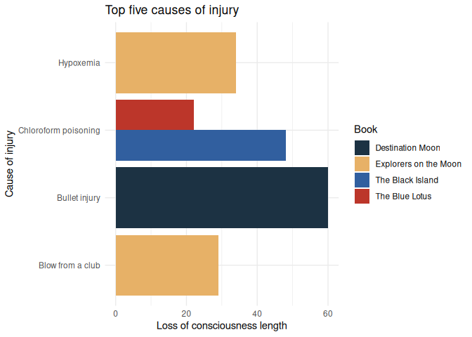
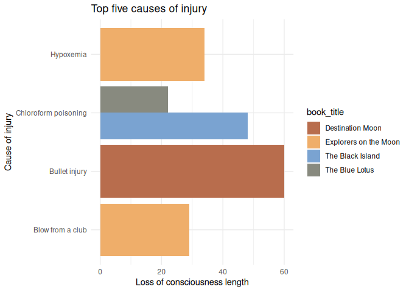
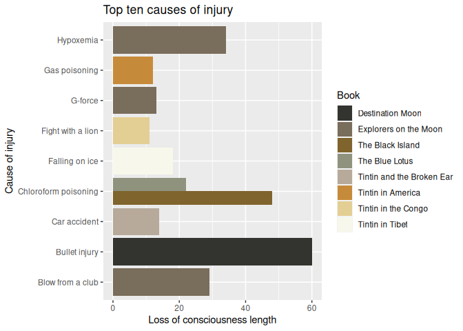
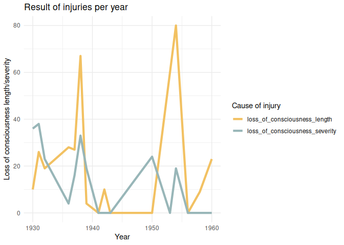

<!-- README.md is generated from README.Rmd. Please edit that file -->

# tintin

<!-- badges: start -->
<!-- badges: end -->

The goal of tintin is to provide palettes generated from Tintin covers.
There is one palette per cover, with a total of 24 palettes of 5 colours
each. Includes functions to interpolate colors in order to create more
colors based on the provided palettes.

## Installation

You can install the development version of tintin like so:

``` r
remotes::install_github("pachadotdev/tintin")
```

## Example

This is a basic example which shows you how to create a plot. We’ll plot
the top five causes of injury in the `tintin_head_trauma` dataset that
comes with the package.

``` r
library(dplyr)
library(ggplot2)
library(tintin)

total_head_trauma_5 <- tintin_head_trauma %>% 
  arrange(-loss_of_consciousness_length) %>% 
  filter(row_number() <= 5)

ggplot(total_head_trauma_5) +
  geom_col(aes(x = cause_of_injury, y = loss_of_consciousness_length, 
    fill = book_title), position = "dodge") +
  labs(x = "Cause of injury", y = "Loss of consciousness length",
    title = "Top five causes of injury") +
  theme_minimal() +
  scale_fill_manual(values = tintin_colours$the_black_island,
    name = "Book") +
  coord_flip()
```



What is special about the package is being able to pass the colours as a
function to `ggplot2`. We’ll adapt the previous example to show that
case.

``` r
ggplot(total_head_trauma_5) +
  geom_col(aes(x = cause_of_injury, y = loss_of_consciousness_length, 
    fill = book_title), position = "dodge") +
  labs(x = "Cause of injury", y = "Loss of consciousness length",
    title = "Top five causes of injury") +
  theme_minimal() +
  scale_fill_tintin_d(option = "cigars_of_the_pharaoh", direction = -1) +
  coord_flip()
```



What happens if we need more colours than 5? The functions in the
package can fix that. We’ll plot the top ten causes of injury.

``` r
total_head_trauma_10 <- tintin_head_trauma %>% 
  arrange(-loss_of_consciousness_length) %>% 
  filter(row_number() <= 10)

ggplot(total_head_trauma_10) +
  geom_col(aes(x = cause_of_injury, y = loss_of_consciousness_length, 
    fill = book_title), position = "dodge") +
  labs(x = "Cause of injury", y = "Loss of consciousness length",
    title = "Top ten causes of injury") +
  scale_fill_manual(values = tintin_clrs(
    n = length(unique(total_head_trauma_10$book_title)), 
    option = "the_black_island"),
    name = "Book") +
  coord_flip()
```


``` r
# or alternatively

ggplot(total_head_trauma_10) +
  geom_col(aes(x = cause_of_injury, y = loss_of_consciousness_length, 
    fill = book_title), position = "dodge") +
  labs(x = "Cause of injury", y = "Loss of consciousness length",
    title = "Top ten causes of injury") +
  scale_fill_manual(values = tintin_pal(option = "the_black_island")(8), 
    name = "Book") +
  coord_flip()
```



The use of colour instead of fill is analogous. Let’s plot the top ten
causes of injury per year to see it.

``` r
library(tidyr)

total_head_trauma_y <- tintin_head_trauma %>% 
  group_by(year) %>% 
  summarise_if(is.integer, sum) %>% 
  pivot_longer(loss_of_consciousness_length:loss_of_consciousness_severity)

ggplot(total_head_trauma_y) +
  geom_line(aes(x = year, y = value, color = name), linewidth = 1.5) +
  labs(x = "Year", y = "Loss of consciousness length/severity",
    title = "Result of injuries per year") +
  theme_minimal() +
  scale_colour_manual(values = tintin_pal(option = "the_secret_of_the_unicorn")(2), 
    name = "Cause of injury")
```


We can also use the package for the continuous case. For this case,
we’ll adapt from `ggplot2` examples.

``` r
dsub <- subset(diamonds, x > 5 & x < 6 & y > 5 & y < 6)

dsub$diff <- with(dsub, sqrt(abs(x - y)) * sign(x - y))

d <- ggplot(dsub, aes(x, y, colour = diff)) + geom_point()

d + 
  scale_colour_tintin_c(option = "the_castafiore_emerald") + 
  theme_bw()
```


